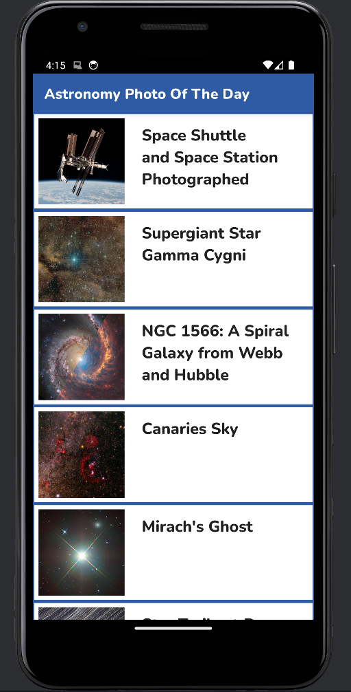
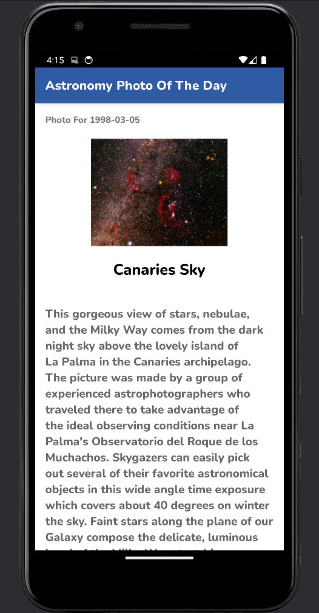

# AstroDaily

An Android application showcasing NASA's Astronomy Picture of the Day.

## Overview

**AstroDaily** is an Android app built using Kotlin and Android Studio. The app fetches data from NASA's Astronomy Picture of the Day (APOD) API to display a collection of space images. Users can browse a list of past APOD thumbnails with their titles and tap on any entry to view a detail page containing the full resolution image, title, date, and a summary provided by NASA.

## Features

* Displays a scrollable list of Astronomy Pictures of the Day.
* Each list item shows a thumbnail of the image and its title.
* Detailed view for each picture, displaying:
    * The full resolution image.
    * The title of the astronomical image.
    * The date the picture was featured.
    * A detailed summary of the image.
* Utilizes a web API to fetch the latest astronomy pictures dynamically.
* **Background Execution and User Notifications:** Implemented using `Worker` and `NotificationManager`. The app uses a `PollWorker` based on `CoroutineWorker` to periodically check the AstroRepository for new astronomy photos. If a new photo is available, a notification is displayed to the user.
* **Automated Unit and UI Testing:** Unit tests were implemented to test individual components of the application. UI tests were also implemented to test user interactions and the application's user interface.
* Styled user interface using Android styling principles.

## Technologies Used

* **Kotlin:** The primary programming language used for the Android application.
* **Android SDK:** The software development kit used to build the Android app.
* **Android Studio:** IDE used for development.
* **Fragments and Layouts:** Used to structure the different screens and UI components of the application.
* **RecyclerView:** Employed to efficiently display the scrollable list of Astronomy Pictures of the Day.
* **Web API Client (HTTP Connection):** Used to communicate with the NASA APOD API.
* **JSON Parsing:** The app uses **Moshi** for parsing the JSON response from the NASA API. **Kotlin Code Generation for Moshi (KAPT)** was also used for more efficient JSON handling.
* **Retrofit:** A type safe HTTP client for Android and Java. It's used here in conjunction with Moshi to simplify the API interaction.
* **OkHttp:** An HTTP client that Retrofit uses.
* **Coil:** An image loading library for Android backed by Kotlin Coroutines.This was used to load and display the astronomy pictures.
* **Kotlin Coroutines:** For managing asynchronous tasks, such as network requests and background work.
* **AndroidX Lifecycle:** Components like `ViewModel` and `LiveData` to manage UI related data in a lifecycle aware way. `lifecycle-runtime-ktx` is also used for managing the lifecycle of coroutines.
* **AndroidX Navigation Component:** `androidx.navigation:navigation-fragment-ktx` and `navigation-ui-ktx` are used to handle navigation between different my fragments, the list view and the detail view.
* **AndroidX WorkManager:** Used for reliable background task execution, specifically for the `PollWorker` to check for new astronomy photos.
* **AndroidX Fragment KTX:** Provides extension functions for working with Fragments more concisely in Kotlin.
* **AndroidX AppCompat:** For using modern Android design principles and compatibility across different Android versions.
* **AndroidX ConstraintLayout:** A layout manager for designing complex UIs.
* **JUnit:** Testing framework for unit tests.
* **AndroidX Test:** Libraries for instrumented UI tests.

## How It Works

1.  **Main List View:** Upon launching the app, a list of recent Astronomy Pictures of the Day is fetched from the NASA APOD API. This list is displayed using a `RecyclerView` for efficient scrolling. Each item in the list shows a thumbnail of the image and its corresponding title.

2.  **Detail View:** When a user taps on an item in the list, the app navigates to a detail screen (implemented using a `Fragment`). This screen displays the full-resolution image, the title, the date of the picture, and the explanation provided by NASA for that day's image.

3.  **API Integration:** The app makes asynchronous HTTP requests to the NASA APOD API using Retrofit. The JSON response containing an array of picture data is then processed using Moshi.

4.  **Data Handling:** The fetched JSON data is parsed to extract relevant information such as the image URL, title, date, and explanation. This data is managed using AndroidX Lifecycle components like ViewModel and LiveData and used to populate the `RecyclerView` and the detail view. Coil is used to efficiently load and display the images from the network.

5.  **Background Notifications:** The `PollWorker` runs periodically in the background using AndroidX WorkManager. It checks the AstroRepository for new data from the NASA APOD API. If new data (a new picture of the day) is found, the `NotificationManager` is used to create and display a notification to the user, informing them about the new astronomy photo. Kotlin Coroutines are used to manage the asynchronous operations within the `PollWorker`.

6.  **Automated Testing:** The application includes both unit tests and UI tests to ensure the reliability and correctness of individual components and the user interface. These tests help verify the app's functionality and user experience.

## Screenshots

